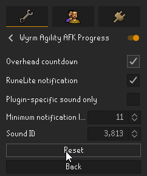

# Wyrm Agility AFK Progress

RuneLite progress timers for the lower and advanced Colossal Wyrm agility
routes. Each timer includes travel and automatic movement across the obstacle,
making it easier to look away and return when the next obstacle is ready.

> Updated for the August 12, 2026 Colossal Wyrm course changes, which increased
> the duration of both routes.

## Features

- A movable progress bar with a single remaining-time display.
- Fixed timings measured from complete laps of both updated Wyrm routes.
- Optional local-only overhead countdown above the player.
- Optional completion sound when the next obstacle is ready.
- Optional native RuneLite notification that follows the client's notification
  settings, including tray notifications, request focus, and taskbar flashing.
- Configurable minimum obstacle length for notifications, allowing short
  obstacles to stay silent while longer AFK sections still notify you.
- Configurable RuneLite sound effect ID with an immediate preview when changed.
- Protection against premature distant clicks replacing the active timer.

The plugin does not automate input or interact with obstacles for the player.

## Notification settings

Enable **Plugin-specific sound only** to hear the configured in-game sound when the active obstacle
finishes. Enable **RuneLite notification** to use RuneLite's native notification
system; RuneLite's global notification settings control tray messages, taskbar
flashing, and requesting focus when the client is minimized.

Set **Minimum notification length** to notify only for obstacles longer than
that number of seconds. For example, setting it to `10` keeps obstacles of 10
seconds or less silent. A value of `0` allows notifications for every obstacle.

Change **Sound ID** with the arrow buttons or enter an ID manually to preview
the selected sound immediately.

## License

BSD 2-Clause License. See `LICENSE`.
